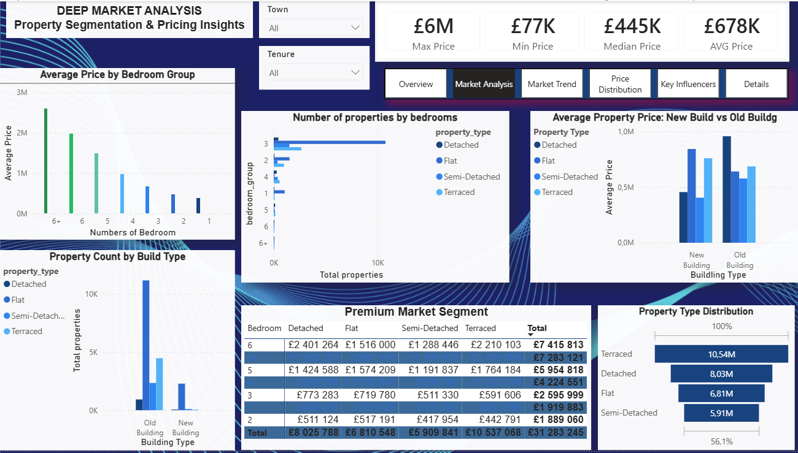
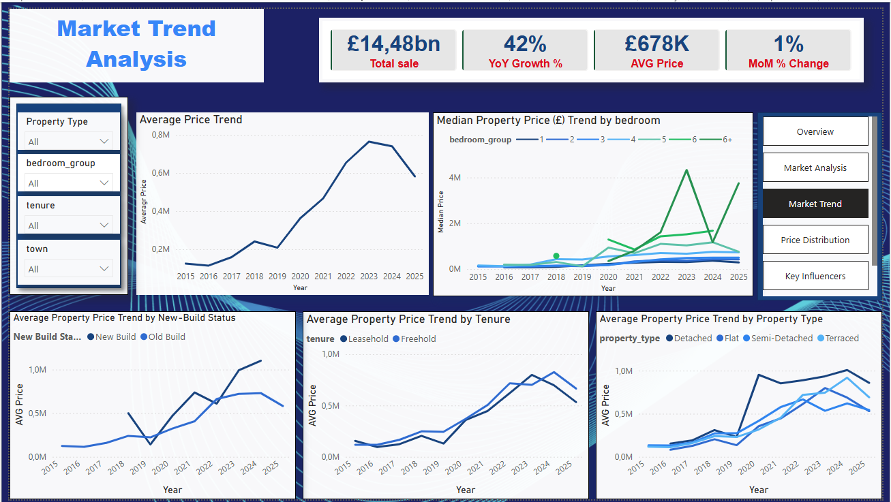
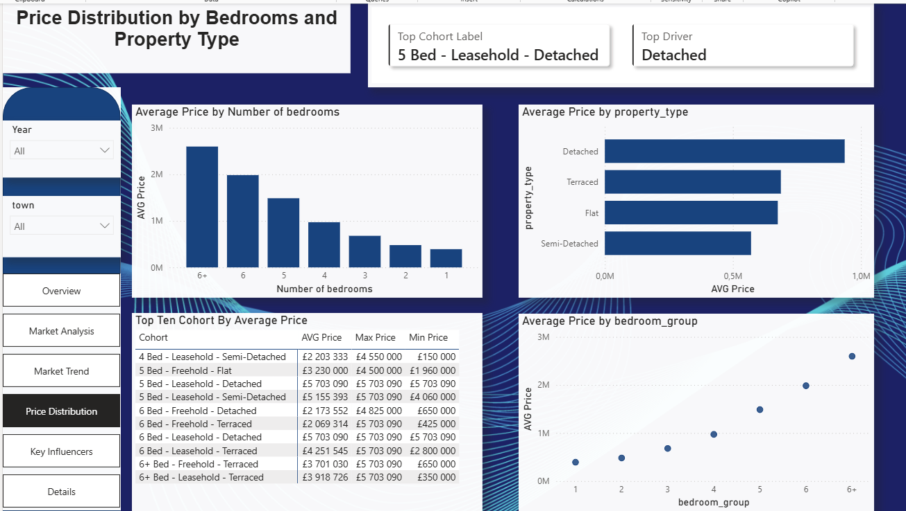
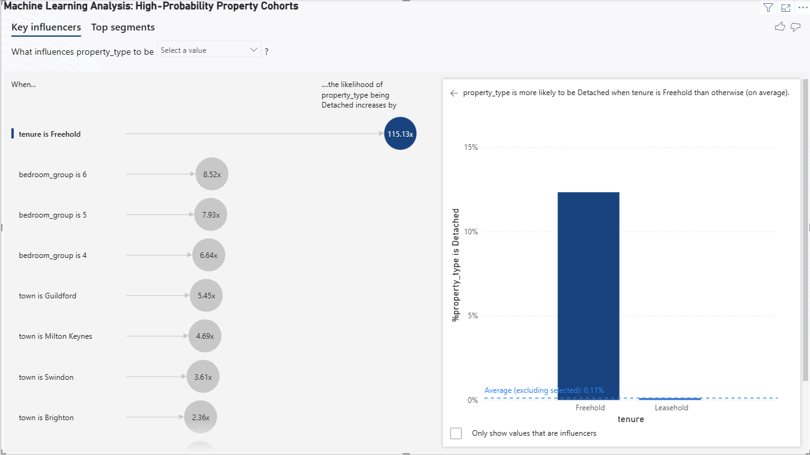
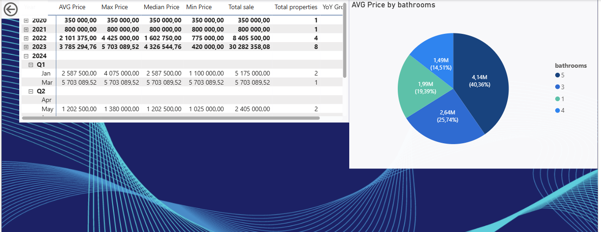

# 🏠 UK Real Estate Market Analytics & Business Intelligence Dashboard

### End-to-End Data Analytics & BI Project | Python → MySQL/SQL → Power BI

An end-to-end data analytics project that transforms raw UK property transaction data into a structured, validated and interactive business intelligence solution.

The project demonstrates practical experience in **data cleaning, transformation, validation, SQL, relational data modelling, analytical queries, ETL workflows, KPI development and Power BI dashboard development**.

---

## 📌 Project Overview

This project takes raw UK property transaction data and develops a complete analytics workflow:

**Raw Data → Python/Pandas → Data Cleaning & Validation → MySQL → SQL Analysis → Power BI → Business Insights**

The solution was designed to answer questions around:

* Property prices
* Property types
* Bedrooms and bathrooms
* Property tenure
* New-build status
* Geographic performance
* Price distributions
* Market trends
* Property segmentation
* Factors influencing property prices

The project combines technical data preparation with business-oriented analysis to produce a reusable analytical dataset and interactive dashboard.

---

## 🎯 Business Problem

Raw property transaction datasets often contain inconsistent data types, invalid records, missing values and fields that are not immediately suitable for analysis.

The objective of this project was to:

1. Clean and validate the raw property dataset.
2. Transform the data into an analysis-ready structure.
3. Load the cleaned data into a relational MySQL database.
4. Use SQL to perform analytical transformations and create reusable views.
5. Connect the database to Power BI.
6. Build an interactive dashboard for exploring property-market patterns.
7. Translate the analysis into meaningful business insights.

---

# 🔄 Data Pipeline

```text
Raw UK Property CSV
        │
        ▼
Python / Pandas / NumPy
        │
        ├── Data profiling
        ├── Data cleaning
        ├── Data-type validation
        ├── Invalid-record handling
        ├── Transformation
        └── Feature preparation
        │
        ▼
MySQL Database
        │
        ├── Relational table structure
        ├── Data validation
        └── SQL transformations
        │
        ▼
SQL Analytical Views
        │
        ▼
ODBC Connection
        │
        ▼
Power BI
        │
        ├── KPI analysis
        ├── Market analysis
        ├── Trend analysis
        ├── Price distribution
        └── Key Influencers
        │
        ▼
Business Insights
```

---

# 🛠️ Technology Stack

| Technology           | Purpose                                      |
| -------------------- | -------------------------------------------- |
| **Python**           | Data preparation and transformation          |
| **Pandas**           | Data manipulation and cleaning               |
| **NumPy**            | Numerical processing                         |
| **MySQL**            | Relational database storage                  |
| **SQL**              | Data querying and analytical transformations |
| **ODBC**             | Database connectivity                        |
| **Power BI**         | Interactive dashboard and visual analytics   |
| **DAX**              | Measures and KPI calculations                |
| **Jupyter Notebook** | Development and analysis                     |
| **GitHub**           | Version control and project documentation    |

---

# 🧹 1. Data Cleaning & Preparation

The raw dataset was first inspected and profiled using Python.

The cleaning workflow included:

* Inspecting dataset structure
* Checking column data types
* Identifying invalid records
* Handling inconsistent values
* Converting fields into appropriate data types
* Removing records that could not be reliably analysed
* Preparing analytical features
* Validating the resulting dataset

### Example workflow

```python
import pandas as pd
import numpy as np

df = pd.read_csv("property_data.csv")

df.info()
df.describe()

# Example transformation
df["price"] = pd.to_numeric(df["price"], errors="coerce")

# Remove records where critical analytical fields are invalid
df = df.dropna(subset=["price"])
```

The objective was not simply to remove rows, but to establish a dataset that could be trusted for downstream SQL and BI analysis.

---

# 🗄️ 2. MySQL Database

After preparation in Python, the cleaned dataset was loaded into MySQL.

Database:

```text
jakua
```

Main analytical table:

```text
sale
```

The database stage provided a structured environment for:

* Storing cleaned data
* Running SQL queries
* Validating records
* Creating analytical views
* Separating data preparation from reporting
* Connecting the dataset to Power BI

---

# 🔎 3. SQL Analysis

SQL was used to analyse the cleaned property data and prepare information for reporting.

Examples of analytical tasks included:

* Property-type analysis
* Average and total property prices
* Geographic comparisons
* Price segmentation
* Trend analysis
* Bedroom/bathroom analysis
* Property-count analysis
* Ranking and aggregation
* Analytical SQL views

Example:

```sql
SELECT
    property_type,
    COUNT(*) AS property_count,
    AVG(price) AS average_price
FROM sale
GROUP BY property_type
ORDER BY average_price DESC;
```

SQL was also used to create reusable analytical datasets/views before the Power BI reporting layer.

---

# 📊 4. Power BI Dashboard

The cleaned and structured MySQL data was connected to Power BI through ODBC.

The dashboard contains **five analytical pages plus a detailed analysis page**, covering different aspects of the property market.

---

## 📈 Executive Overview

The overview page provides a high-level view of the dataset and key market indicators.

It allows users to quickly understand:

* Overall property volumes
* Average property prices
* Property-type distribution
* Major market segments
* Geographic patterns


---

## 🔍 Market Analysis

The market-analysis page provides deeper analysis of property characteristics and market segments.

It explores relationships between:

* Property type
* Price
* Bedrooms
* Bathrooms
* Tenure
* New-build status
* Geography



---

## 📈 Market Trends

The trend analysis page examines how property activity and prices change over time.

It supports analysis of:

* Price movements
* Transaction activity
* Market patterns
* Geographic trends
* Property-type trends



---

## 💷 Price Distribution

The price-distribution page examines how property prices are distributed across the dataset.

It helps identify:

* Lower and higher price segments
* Average prices
* Price concentration
* Differences between property types
* Distribution patterns



---

## 🧠 Key Influencers

The Key Influencers page uses Power BI's analytical capabilities to investigate factors associated with property prices.

The analysis considers variables such as:

* Property type
* Bedrooms
* Bathrooms
* Tenure
* New-build status
* Geographic characteristics



---

## 📋 Detailed Analysis

The detailed analysis page provides a more granular view of individual property characteristics and supporting analytical information.



---

# 📌 Key Findings

The analysis identified several notable patterns within the cleaned dataset.

### Property-Type Distribution

The largest property segment is **Flats**, followed by:

1. Flats
2. Terraced properties
3. Semi-detached properties
4. Detached properties

### Average Price by Property Type

Based on the analysed dataset:

| Property Type | Average Price |
| ------------- | ------------: |
| Detached      |   £936,466.21 |
| Terraced      |   £687,272.35 |
| Flat          |   £675,253.43 |
| Semi-detached |   £570,867.21 |

These differences demonstrate how property type can be associated with substantial differences in average transaction value.

---

# 📊 Analytical Questions

The dashboard was designed around practical analytical questions, including:

### Market Structure

* Which property types dominate the dataset?
* What proportion of transactions belong to each property category?
* How does property composition vary geographically?

### Pricing

* Which property types have the highest average prices?
* How are property prices distributed?
* Which characteristics are associated with higher prices?

### Trends

* How do transaction volumes change over time?
* How do average prices change over time?
* Are there differences between property categories?

### Property Characteristics

* How do bedrooms relate to property prices?
* How do bathrooms relate to property prices?
* Does new-build status affect pricing?
* How does tenure differ across property types?

---

# 🧪 Data Quality & Validation

Data quality was an important part of the project.

The workflow included:

* Data profiling before transformation
* Data-type checks
* Identification of invalid records
* Validation of critical analytical fields
* Cleaning before database loading
* SQL-level validation
* Verification of Power BI outputs

This helped reduce the risk of producing dashboards from unreliable or incorrectly typed data.

---

# 🔧 ETL Workflow

The project demonstrates a practical ETL-style workflow:

### Extract

Raw property transaction data was imported from CSV.

### Transform

Python/Pandas was used to:

* Inspect
* Clean
* Validate
* Transform
* Prepare the dataset

### Load

The prepared dataset was loaded into MySQL.

### Analyse

SQL was used to create analytical queries and views.

### Visualise

Power BI consumed the structured data through ODBC and transformed it into interactive business intelligence reports.

---

# 🎥 Project Demonstration

## Dashboard Walkthrough

A recorded walkthrough of the Power BI dashboard demonstrates the project from a user's perspective.

**▶️ [Watch the Dashboard Demonstration](video/UK_Real_Estate_Dashboard_Demo.mp4)**

The demonstration covers:

* Dashboard navigation
* KPI analysis
* Market analysis
* Trend analysis
* Price distribution
* Key Influencers
* Interactive filtering

---

# 📁 Project Structure

```text
uk-real-estate-analytics/
│
├── Images/
│   ├── overview.png
│   ├── market_analysis.png
│   ├── market_trend.png
│   ├── price_distribution.png
│   ├── key_influencers.png
│   └── details.png
│
├── video/
│   └── UK_Real_Estate_Dashboard_Demo.mp4
│
├── data/
│   └── property_data.csv
│
├── notebooks/
│   └── data_cleaning_and_analysis.ipynb
│
├── sql/
│   └── analytical_queries.sql
│
└── README.md
```

---

# 💡 Skills Demonstrated

## Data Engineering & Data Preparation

* Data ingestion
* Data profiling
* Data cleaning
* Data transformation
* Data validation
* ETL workflow
* Relational database loading
* Data quality checks

## SQL & Database

* MySQL
* SELECT queries
* Aggregations
* GROUP BY
* Filtering
* Analytical transformations
* SQL views
* Relational data structures

## Python

* Python
* Pandas
* NumPy
* Data manipulation
* Data cleaning
* Feature preparation
* Data validation

## Business Intelligence

* Power BI
* DAX
* KPI development
* Interactive dashboards
* Data visualisation
* Trend analysis
* Segmentation
* Key Influencers

## Analytical Thinking

* Problem definition
* Data-quality assessment
* Exploratory data analysis
* Pattern identification
* Business interpretation
* Communicating analytical findings

---

# 🎯 What This Project Demonstrates

This project demonstrates my ability to move beyond isolated analysis and build a complete analytical workflow:

```text
Business Problem
       ↓
Raw Data
       ↓
Data Profiling
       ↓
Data Cleaning
       ↓
Data Transformation
       ↓
Relational Database
       ↓
SQL Analysis
       ↓
BI Modelling
       ↓
Dashboard
       ↓
Business Insights
```

The project particularly demonstrates practical experience connecting **Python, SQL/MySQL and Power BI** into one workflow.

---

# 🚀 Future Improvements

Potential future enhancements include:

* Implementing automated pipeline execution
* Adding more advanced SQL transformations
* Introducing additional data sources
* Connecting external APIs
* Improving data lineage documentation
* Adding automated data-quality checks
* Implementing incremental data loading
* Adding cloud-based data infrastructure
* Introducing orchestration tools
* Expanding monitoring and pipeline observability

These improvements would extend the project from a portfolio analytics workflow toward a more production-oriented data engineering architecture.

---

# 👤 Author

**Jakuaterua Kaitjindi**

Applied Mathematics & Statistics Graduate | Business Intelligence Analyst | SQL, Python & Power BI

📧 **Email:** [jkjakuaterua@gmail.com](mailto:jkjakuaterua@gmail.com)

💼 **LinkedIn:**
https://linkedin.com/in/jakuaterua-kaitjindi-81b049155/

💻 **GitHub:**
https://github.com/Jakua

---

# 📌 Project Repository

**GitHub Repository:**
https://github.com/Jakua/uk-real-estate-analytics

---

## ⭐ Summary

This project demonstrates an end-to-end approach to transforming raw property data into a structured analytical solution using:

**Python → Data Cleaning → MySQL → SQL → ODBC → Power BI → Business Intelligence**

It combines data preparation, database engineering, analytical SQL and interactive reporting to demonstrate practical capabilities relevant to **Data Analyst, BI Analyst, Analytics Engineer and Junior Data Engineer** roles.
