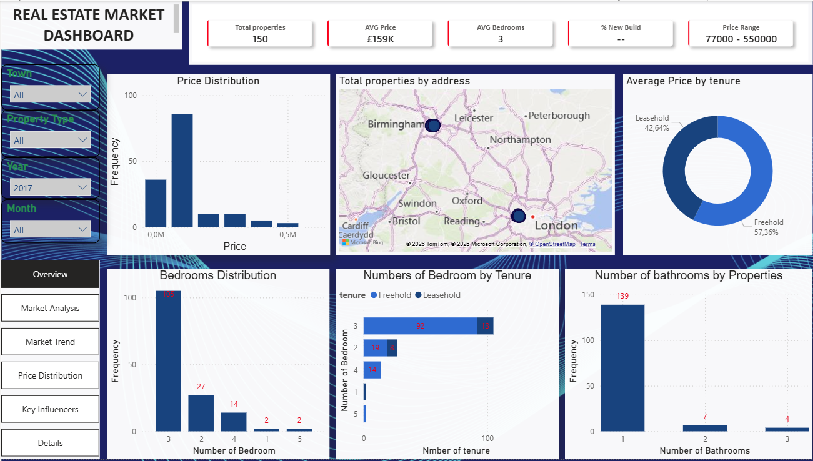

# 🏠 UK Real Estate Market Analytics & Business Intelligence Dashboard

### 🚀 End-to-End Data Analytics Project | Python → MySQL/SQL → Power BI

An end-to-end real estate analytics and Business Intelligence project analysing UK residential property data to identify **pricing patterns, property segmentation, market composition, geographical distribution and factors associated with property prices**.

---

# 📊 Project Overview

This project transforms raw UK property data into an interactive Business Intelligence solution using:

**Python → MySQL/SQL → Power BI**

The project analyses:

- Property prices
- Property types
- Bedrooms
- Bathrooms
- Tenure
- New-build status
- Geographical distribution
- Market trends
- Property segmentation

The original dataset contained **22,258 property records**.

After data cleaning, transformation, standardisation and validation, **21,361 records** were retained for analysis.

---

# 🎥 Project Demonstration

## Dashboard Walkthrough

The video below demonstrates the completed Power BI dashboard and its interactive analytical features.

🎯 Business Problem

The UK property market contains a large volume of information about properties, prices and property characteristics. However, raw property data can be difficult to interpret and use for decision-making without appropriate data cleaning, analysis and visualisation.

Business Question

How can UK property data be transformed into actionable insights that help stakeholders understand property prices, market composition, property characteristics and geographical differences?

The project investigates questions such as:

What is the average and median property price?
Which property types dominate the market?
How does property price vary by bedroom count?
How does property type affect property prices?
How does new-build status relate to property prices?
How does tenure relate to property characteristics and prices?
How are properties distributed across different towns?
How does the property market change over time?
🎯 Project Objectives

The main objectives of the project were to:

Clean and validate the raw UK property dataset.
Identify and handle missing values.
Standardise property categories.
Convert prices and dates into appropriate data types.
Identify and manage extreme property prices.
Clean and standardise geographical information.
Perform exploratory data analysis using Python.
Perform analytical queries using MySQL and SQL.
Build an interactive Power BI dashboard.
Identify important property-market patterns.
Generate business insights and recommendations.
🛠️ Technologies Used
Technology	Purpose
🐍 Python	Data cleaning, preparation and analysis
🐼 Pandas	Data manipulation and transformation
🔢 NumPy	Numerical analysis
🗄️ MySQL	Database storage and analysis
💻 SQL	Exploratory and analytical queries
📊 Power BI	Interactive dashboards and visualisation
📐 DAX	Power BI calculations and measures
📗 Microsoft Excel	Cleaned dataset export and reporting
🐍 Python Data Cleaning & Preparation

Python was used as the main data-preparation environment.

The original dataset contained 22,258 rows and 10 columns.

The initial data-quality assessment identified missing values in:

Property type
Bedrooms
Bathrooms
Tenure

The property_subtype field contained no usable observations and was removed.

Key Data Cleaning Steps
1. Date Conversion

The latest_date column was converted into a proper datetime format.

2. Price Cleaning

Currency symbols and formatting were removed from the property price field and converted into a numeric format.

3. Missing Value Treatment

Missing bedroom values were treated using the mean bedroom value.

Missing bathroom values were treated using the mean bathroom value.

Missing tenure values were treated using the most frequent category.

4. Property Type Standardisation

Property types were standardised into four categories:

Flat
Terraced
Semi-Detached
Detached

Invalid property-type records were removed.

5. Outlier Treatment

Extreme property prices were controlled using the 1st and 99th percentiles.

6. Bedroom Segmentation

The bedroom categories used for analysis were:

1 | 2 | 3 | 4 | 5 | 6 | 6+

6+ represents properties with more than six bedrooms.

7. Bathroom Treatment

Bathroom values were capped at a maximum of 5 to reduce the influence of extreme observations.

8. Address & Geographical Cleaning

Property addresses were cleaned and town/city information was extracted and standardised for geographical analysis.

The resulting analysis included locations such as:

London
Birmingham
Manchester
Liverpool
Guildford
Brighton
Maidstone
Aberdeen
Swindon
Reading
Slough
Rochester
Milton Keynes
📈 Data Quality Results

After cleaning and transformation:

Data Quality Measure	Result
Original records	22,258
Final analytical records	21,361
Duplicate rows	0
Missing values in final analytical dataset	0

The final dataset was structured and prepared for SQL analysis and Power BI reporting.

🗄️ MySQL & SQL Analysis

The cleaned dataset was migrated into a MySQL database for structured storage and analytical querying.

SQL was used to investigate:

Dataset Overview

Determining the total number of property records.

SELECT 
    COUNT(*) AS total_rows
FROM sale;
Property Type Distribution

Analysing the number of properties within each property category.

Average Price by Property Type

Comparing average property prices across:

Flats
Terraced
Semi-Detached
Detached
Bedroom Distribution

Analysing property volume by bedroom count.

Property Type × Bedroom Segmentation

Analysing property volume and average price across property types and bedroom categories.

Price Ranking

A SQL window function was used to rank property types by average price within each bedroom category.

RANK() OVER (
    PARTITION BY bedrooms 
    ORDER BY AVG(latest_price) DESC
) AS price_rank
New Build vs Old Build

Comparing property volume and average price between new-build and older properties.

Tenure Analysis

Analysing the relationship between tenure, bedrooms, property volume and average price.

📊 Power BI Dashboard

An interactive 6-page Power BI dashboard was developed to transform the analytical results into an executive-friendly Business Intelligence solution.

Dashboard Pages
1️⃣ Executive Overview

Provides a high-level snapshot of the UK property market.

Key metrics include:

Total properties
Average property price
Average bedrooms
New-build percentage
Minimum price
Maximum price
Price distribution
Property distribution
2️⃣ Deep Market Analysis

Focuses on property segmentation and pricing.

Includes:

Average price by bedroom group
Property volume by bedrooms
New Build vs Old Build
Property type distribution
Premium market segments
3️⃣ Market Trend Analysis

Examines property-price behaviour across time and structural segments.

The analysis helps identify changing pricing patterns across different property segments.

4️⃣ Price Distribution

Examines the distribution and spread of property prices across key property characteristics.

5️⃣ Key Influencers

Uses the Power BI Key Influencers visual to investigate factors associated with property-price variation.

6️⃣ Details

Provides detailed property-level analysis and supporting information for deeper exploration.

# 📸 Dashboard Screenshots
## Dashboard Screenshot

🏢 Property Type Distribution

The cleaned dataset contains:

Property Type	Number of Properties
Flat	13,477
Terraced	4,506
Semi-Detached	2,439
Detached	967
Key Insight

Flats represent the largest property category within the dataset.

🛏️ Bedroom Distribution

Three-bedroom properties represent the largest bedroom segment, with:

15,409 properties

The analysis uses the following bedroom segmentation:

1 | 2 | 3 | 4 | 5 | 6 | 6+

This approach retains detail for the main bedroom categories while grouping properties with more than six bedrooms into a single segment.

💷 Property Pricing

The cleaned dataset contains:

Metric	Value
Average Price	£677,695
Median Price	£445,000
Minimum Price	£77,000
Maximum Price	£5,703,090

The difference between the average and median price indicates that property prices have a wide distribution, with higher-priced properties influencing the overall average.

📍 Geographical Distribution

The analysis standardised property locations into towns/cities including:

London
Birmingham
Manchester
Liverpool
Guildford
Brighton
Maidstone
Aberdeen
Swindon
Reading
Slough
Rochester
Milton Keynes

London represents the largest geographical segment in the cleaned dataset.

💡 Business Recommendations
1. Property Type Segmentation

Property type should be considered when evaluating market demand and pricing because different property types represent different market segments.

2. Bedroom-Based Analysis

Bedroom count provides an important segmentation variable for understanding property pricing and market composition.

3. Geographical Segmentation

Property-market performance should be evaluated at the town/city level rather than relying only on overall market averages.

4. New Build vs Older Properties

Separating new-build and older properties provides additional insight into differences in market pricing.

5. Median Price

Median price should be considered alongside average price because property prices have a wide distribution.

6. Interactive Business Intelligence

The Power BI dashboard allows stakeholders to interactively explore the market using filters and different property characteristics.

📁 Project Structure
UK-Real-Estate-Market-Analytics/
│
├── 1_Python_Pipeline/
│   └── real_estate_analysis.ipynb
│
├── 2_SQL_Scripts/
│   └── exploratory_analysis.sql
│
├── 3_PowerBI_Dashboard/
│   └── Real_Estate_Market_Dashboard.pbix
│
├── data/
│   └── properties_main_cleaned.xlsx
│
├── Images/
│   ├── overview.png
│   ├── market_analysis.png
│   ├── market_trend.png
│   ├── price_distribution.png
│   ├── key_influencers.png
│   └── details.png
│
├── video/
│   └── UK_Real_Estate_Dashboard_Demo.mp4
│
├── README.md
│
└── requirements.txt
👤 Skills Demonstrated
🐍 Data Analytics
Python
Pandas
NumPy
Data cleaning
Data validation
Data transformation
Missing-value treatment
Outlier treatment
Feature engineering
Exploratory Data Analysis
🗄️ SQL & Database
MySQL
SQL aggregation
COUNT()
AVG()
ROUND()
GROUP BY
ORDER BY
CASE
Window functions
RANK()
Market segmentation
📊 Business Intelligence
Power BI
DAX
KPI development
Interactive dashboards
Data visualisation
Market segmentation
Trend analysis
Key Influencers
Business recommendations
Data storytelling
🚀 Future Improvements

Future development could include:

Property-price forecasting
Advanced regression modelling
More detailed regional analysis
Automated data-refresh pipelines
Additional economic variables
Advanced Power BI measures
Predictive market indicators
🔐 Data Security

Database credentials, passwords and other sensitive information should never be uploaded to GitHub.

Database connection credentials should be stored using environment variables or a local configuration file that is excluded from version control.

⭐ Project Outcome

This project demonstrates an end-to-end Data Analytics and Business Intelligence workflow:

Raw Data
   ↓
Python
   ↓
Data Cleaning & Transformation
   ↓
MySQL
   ↓
SQL Analysis
   ↓
Power BI
   ↓
Interactive Dashboard
   ↓
Business Insights
   ↓
Recommendations

The project demonstrates practical experience in:

Python • Pandas • SQL • MySQL • Power BI • DAX • Data Cleaning • Exploratory Data Analysis • Data Visualisation • Business Intelligence • Data Storytelling

📌 Conclusion

The UK Real Estate Market Analytics Dashboard demonstrates how raw property data can be transformed into a structured analytical solution using Python, MySQL/SQL and Power BI.

The final dashboard provides an interactive environment for analysing:

Property prices • Property types • Bedrooms • Bathrooms • Tenure • Build status • Geographical distribution • Market trends

The project combines technical data-analysis skills with business-focused interpretation to support a more informed understanding of the UK residential property market.
